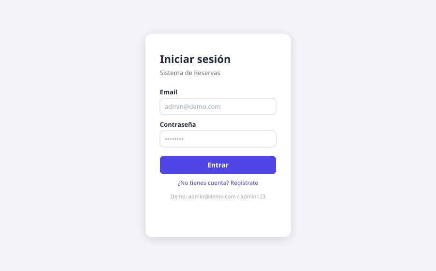
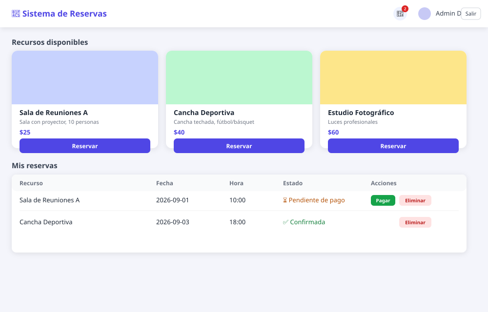
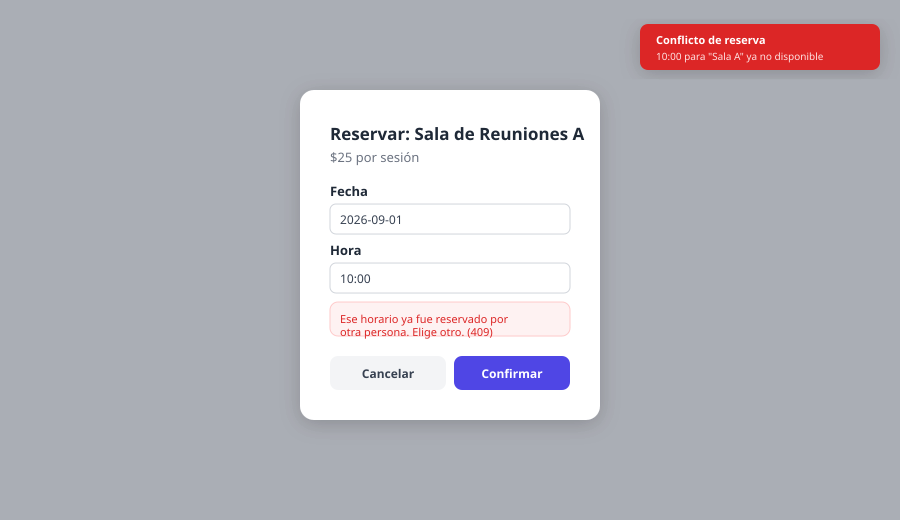
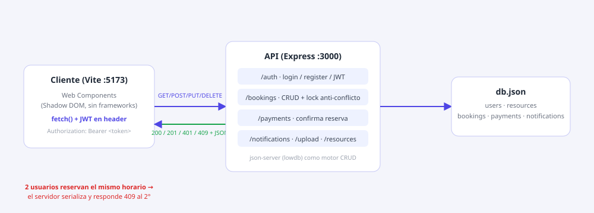

# 📅 Sistema de Reservas — CRUD API

Aplicación de reservas con **autenticación, pagos, subida de imágenes y notificaciones**, construida con **Vite + Web Components (JavaScript vanilla)** en el frontend y **json-server + Express** en el backend, expuesto en el **puerto 3000**.

El caso interesante de este proyecto: **¿qué pasa si dos personas reservan el mismo horario al mismo tiempo?** El backend lo resuelve serializando las escrituras y devolviendo `409 Conflict` a quien llega segundo, con su respectiva notificación.



---

## Índice

1. [Vista previa](#vista-previa)
2. [Características](#características)
3. [Stack técnico](#stack-técnico)
4. [Arquitectura](#arquitectura)
5. [Paso a paso: cómo inicializarlo](#paso-a-paso-cómo-inicializarlo)
6. [Probar el conflicto de doble reserva](#probar-el-conflicto-de-doble-reserva)
7. [¿Qué es HTTP y qué es un CRUD?](#qué-es-http-y-qué-es-un-crud)
8. [Cómo se aplicó esto en este proyecto](#cómo-se-aplicó-esto-en-este-proyecto)
9. [Endpoints de la API](#endpoints-de-la-api)
10. [Estructura del proyecto](#estructura-del-proyecto)
11. [Ramas y flujo de trabajo](#ramas-y-flujo-de-trabajo)

---

## Vista previa

| Login | Dashboard (recursos + reservas) |
|---|---|
|  |  |

| Conflicto de doble reserva (409) | Arquitectura / flujo HTTP |
|---|---|
|  |  |

---

## Características

- 🔐 **Autenticación**: registro y login con **JWT**, sesión persistida en `localStorage`.
- 📦 **Reservas (bookings)**: CRUD completo — **GET, POST, PUT, DELETE** — vía HTTP puro con `fetch`, sin librerías intermedias.
- ⚡ **Control de concurrencia**: si dos personas reservan el mismo recurso + fecha + hora, el servidor **serializa** las escrituras (cola de promesas) y responde `409 Conflict` a quien llega en segundo lugar. La primera reserva se confirma normalmente.
- 💳 **Pagos**: al pagar una reserva pendiente, esta pasa de `pending_payment` a `confirmed`.
- 🖼️ **Imágenes**: subida de imágenes (drag/click) convertidas a base64 y usadas como portada de cada recurso reservable.
- 🔔 **Notificaciones**: campana con contador de no leídas + notificaciones automáticas al crear una reserva, al pagar y al chocar con un conflicto de horario.
- 🧩 **Web Components 100% vanilla** (sin React/Vue/Angular): cada pieza de UI es un `customElement` con **Shadow DOM** encapsulado: `app-root`, `auth-view`, `resource-list`, `booking-form`, `booking-list`, `payment-modal`, `notification-center`, `image-uploader`.

## Stack técnico

| Capa | Tecnología |
|---|---|
| Frontend | Vite, JavaScript vanilla, Web Components (Custom Elements + Shadow DOM) |
| Backend | Node.js, Express, json-server (motor CRUD sobre `db.json`) |
| Auth | JSON Web Tokens (`jsonwebtoken`) |
| Comunicación | HTTP/REST con `fetch` (GET, POST, PUT, DELETE) |
| Persistencia | `server/db.json` (base de datos basada en archivo, vía lowdb/json-server) |

## Arquitectura


- El **cliente** (Vite, puerto `5173`) es una SPA de Web Components sin frameworks. Cada request lleva el JWT en el header `Authorization: Bearer <token>`.
- El **servidor** (Express, puerto `3000`) expone rutas REST propias para `auth`, `bookings`, `payments`, `notifications`, `resources` y `upload`, y usa `json-server` como motor de persistencia sobre `db.json`.
- La ruta `POST /bookings` mantiene una **cola de promesas** (`bookingLock`) para que, si llegan dos solicitudes casi al mismo tiempo para el mismo recurso/fecha/hora, se procesen una tras otra: la primera gana, la segunda recibe `409`.

---

## Paso a paso: cómo inicializarlo

### 1. Requisitos
- [Node.js](https://nodejs.org/) 18 o superior
- npm (viene con Node)

### 2. Clonar el repositorio

```bash
git clone https://github.com/DEIMER-PY/crud-booking-system.git
cd crud-booking-system
git checkout develop
```

### 3. Instalar dependencias

```bash
npm install
```

### 4. Levantar el backend (API + json-server) — puerto 3000

```bash
npm run server
```

Deberías ver: `API + JSON Server escuchando en http://localhost:3000`

### 5. Levantar el frontend (Vite) — en otra terminal

```bash
npm run dev
```

Abre el navegador en `http://localhost:5173`.

### 6. Iniciar sesión

Usa el usuario de prueba ya cargado en `server/db.json`:

```
Email:      admin@demo.com
Contraseña: admin123
```

O crea una cuenta nueva desde "¿No tienes cuenta? Regístrate".

### 7. Flujo típico dentro de la app

1. Elige un recurso (sala, cancha, estudio) y pulsa **Reservar**.
2. Escoge fecha y hora → **Confirmar**. La reserva queda `pending_payment`.
3. Se abre el modal de **pago**: completa nombre y número de tarjeta (simulado) → **Pagar**.
4. La reserva pasa a `confirmed` y llega una notificación 🔔.
5. Como admin, puedes agregar nuevos recursos con imagen desde el panel inferior de "Recursos disponibles".

---

## Probar el conflicto de doble reserva

Esta es la parte que "parece simple hasta que dos personas reservan el mismo horario":

1. Abre **dos pestañas o dos navegadores** distintos (o dos usuarios logueados).
2. En ambas, selecciona el **mismo recurso**, la **misma fecha** y la **misma hora**.
3. Confirma la reserva casi al mismo tiempo en las dos pestañas.
4. Resultado: la primera petición que llega al servidor **gana** y queda `pending_payment`; la segunda recibe un **`409 Conflict`** con el mensaje *"Ese horario ya fue reservado por otra persona"*, más una notificación de error.

Esto se probó también directamente contra la API con dos peticiones `curl` simultáneas al mismo `resourceId/date/time`: una respondió `201 Created` y la otra `409`.

También puedes probarlo por HTTP puro:

```bash
curl -X POST http://localhost:3000/bookings \
  -H "Content-Type: application/json" \
  -H "Authorization: Bearer <TOKEN>" \
  -d '{"resourceId":"r1","date":"2026-09-01","time":"10:00"}'
```

Ejecuta ese mismo comando dos veces en paralelo y compara las respuestas.

---

## ¿Qué es HTTP y qué es un CRUD?

### HTTP

HTTP (*HyperText Transfer Protocol*) es el protocolo que usa el navegador (o cualquier cliente) para **hablar con un servidor**: el cliente envía una **petición (request)** a una URL, y el servidor responde con una **respuesta (response)** que incluye un código de estado y, normalmente, datos en JSON.

Los métodos HTTP más usados —y los que usa este proyecto— son:

| Método | Propósito | Ejemplo en este proyecto |
|---|---|---|
| **GET** | Leer/consultar datos, sin modificarlos | `GET /bookings` → lista mis reservas |
| **POST** | Crear un recurso nuevo | `POST /bookings` → crea una reserva |
| **PUT** | Actualizar/reemplazar un recurso existente | `PUT /bookings/:id` → cambia el estado de una reserva |
| **DELETE** | Eliminar un recurso | `DELETE /bookings/:id` → cancela una reserva |

Cada respuesta trae un **código de estado**, por ejemplo:

- `200 OK` — la petición se procesó bien.
- `201 Created` — se creó un nuevo recurso (por ejemplo, una reserva).
- `401 Unauthorized` — falta el token o es inválido.
- `403 Forbidden` — el usuario no tiene permiso sobre ese recurso.
- `404 Not Found` — el recurso no existe.
- `409 Conflict` — hay un conflicto con el estado actual del servidor (**el caso de la doble reserva**).

### CRUD

CRUD son las cuatro operaciones básicas que se pueden hacer sobre cualquier dato: **C**reate, **R**ead, **U**pdate, **D**elete. Es el patrón detrás de casi cualquier API o sistema que administra información persistente (usuarios, productos, reservas, etc.). Cada operación CRUD se mapea de forma natural a un método HTTP:

| CRUD | HTTP | Significado |
|---|---|---|
| Create | POST | Crear un nuevo registro |
| Read | GET | Leer uno o varios registros |
| Update | PUT | Modificar un registro existente |
| Delete | DELETE | Borrar un registro |

## Cómo se aplicó esto en este proyecto

Este trabajo implementa un CRUD completo de **reservas (bookings)**, **recursos**, **pagos** y **notificaciones**, todo hablando por HTTP puro (sin SDKs ni GraphQL):

- **Create** → `POST /bookings`, `POST /resources`, `POST /payments`. Al crear una reserva es donde se aplica la validación de conflicto de horario.
- **Read** → `GET /bookings`, `GET /resources`, `GET /notifications`. Cada usuario solo ve sus propias reservas/pagos (o todo, si es `admin`).
- **Update** → `PUT /bookings/:id`, `PUT /resources/:id`, `PUT /notifications/:id` (por ejemplo, para marcar una notificación como leída, o cambiar el estado de una reserva).
- **Delete** → `DELETE /bookings/:id`, `DELETE /resources/:id`, para cancelar una reserva o eliminar un recurso.

En el **frontend**, cada Web Component habla con la API a través de un pequeño cliente HTTP (`src/api.js`) que agrega el token JWT a cada request y traduce los errores del servidor (incluido el `409`) en mensajes que el usuario ve directamente en el formulario. La comunicación entre componentes (por ejemplo, "se creó una reserva, abre el modal de pago") se hace con un **event bus** (`src/bus.js`) basado en `CustomEvent`, respetando el aislamiento del Shadow DOM de cada componente.

En el **backend**, `server/server.js` combina `json-server` (que ya da CRUD automático) con rutas propias de Express para todo lo que necesita lógica adicional: autenticación con JWT, verificación de conflictos de horario mediante una cola de promesas (`bookingLock`), y la generación de notificaciones cuando ocurre un evento relevante (reserva creada, conflicto, pago aprobado).

---

## Endpoints de la API

| Método | Ruta | Auth | Descripción |
|---|---|---|---|
| POST | `/auth/register` | No | Registro de usuario nuevo |
| POST | `/auth/login` | No | Login, devuelve `{ user, token }` |
| GET | `/auth/me` | Sí | Datos del usuario autenticado |
| GET | `/resources` | No | Listar recursos reservables |
| POST | `/resources` | Sí | Crear recurso (con imagen) |
| PUT | `/resources/:id` | Sí | Editar recurso |
| DELETE | `/resources/:id` | Sí | Eliminar recurso |
| GET | `/bookings` | Sí | Listar mis reservas (o todas, si admin) |
| POST | `/bookings` | Sí | Crear reserva — **valida conflicto de horario (409)** |
| PUT | `/bookings/:id` | Sí | Editar una reserva propia |
| DELETE | `/bookings/:id` | Sí | Cancelar una reserva propia |
| POST | `/payments` | Sí | Pagar una reserva pendiente → la confirma |
| GET | `/payments` | Sí | Listar mis pagos |
| GET | `/notifications` | Sí | Listar mis notificaciones |
| PUT | `/notifications/:id` | Sí | Marcar notificación como leída |
| POST | `/upload` | Sí | Subir imagen (base64) |

---

## Estructura del proyecto

```
CRUD_API/
├── server/
│   ├── server.js        # API Express + json-server (auth, bookings, pagos, notificaciones)
│   └── db.json           # Base de datos (usuarios, recursos, reservas, pagos, notificaciones)
├── src/
│   ├── api.js             # Cliente HTTP (fetch + JWT)
│   ├── bus.js              # Event bus entre Web Components
│   ├── main.js             # Punto de entrada
│   ├── styles/global.css
│   └── components/
│       ├── app-root.js            # Orquesta toda la app
│       ├── auth-view.js           # Login / registro
│       ├── resource-list.js       # Catálogo de recursos + alta (admin)
│       ├── booking-form.js        # Modal para crear una reserva
│       ├── booking-list.js        # Tabla de mis reservas (CRUD)
│       ├── payment-modal.js       # Modal de pago
│       ├── notification-center.js # Campana de notificaciones
│       └── image-uploader.js      # Subida de imágenes a base64
├── docs/screenshots/       # Imágenes usadas en este README
├── index.html
├── vite.config.js
└── package.json
```

## Ramas y flujo de trabajo

La rama principal del repositorio es **`develop`**. Cada funcionalidad se desarrolló en su propia rama `feature/*` y luego se integró a `develop`:

- `feature/auth` — autenticación y JWT
- `feature/bookings` — recursos, formulario y listado de reservas, conflicto de doble reserva
- `feature/payments` — modal y lógica de pagos
- `feature/notifications` — centro de notificaciones
- `feature/app-shell` — componente raíz que conecta todo
- `feature/docs` — este README y la documentación visual

```bash
git checkout develop
git log --oneline --graph --all
```
